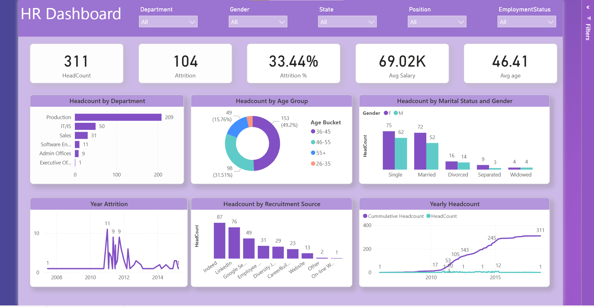
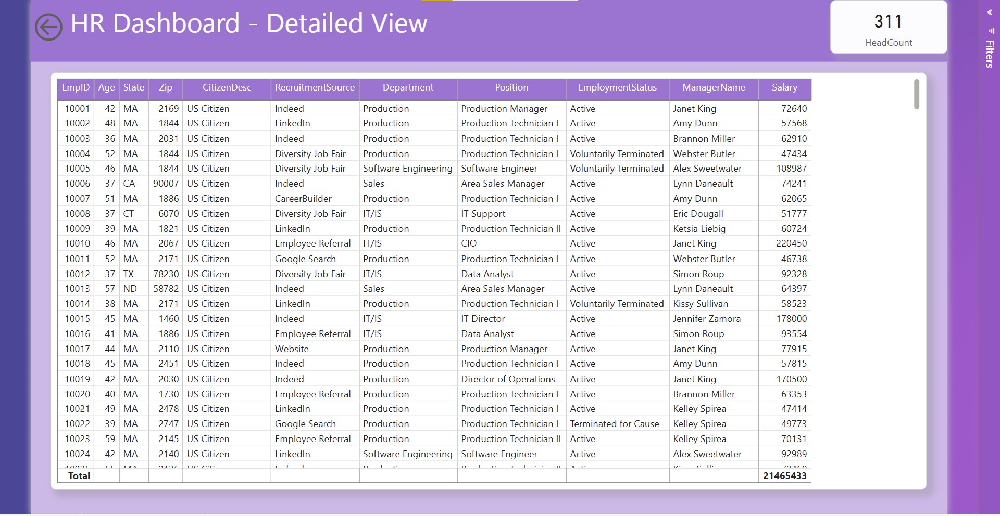

# portfolio

HR Analytics Dashboard (Power BI)

**Tools Used**: Power BI, Excel, DAX, Power Query  
**Description**: Built an interactive dashboard to explore attrition, department trends, and employee performance using IBM HR data.  
- Department-wise attrition and employee distribution
- Gender breakdown and education level insights
- Key HR KPIs with interactive slicers and filters
- Professional layout and user-friendly interface

[Watch Dashboard Walkthrough on Google Drive](https://drive.google.com/file/d/1WbXm5vH0M4gR7-xcxUvv-5G4ETrx7LIj/view?usp=sharing)
**Screenshot**:
  

